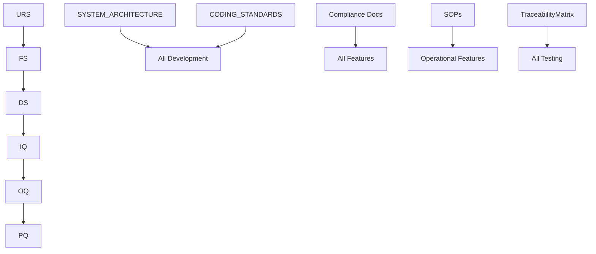

# GACP-ERP Documentation Navigation Matrix

> **Comprehensive Reference Guide for All Project Documentation**  
> Version: 1.0  
> Date: September 15, 2025  
> Purpose: Complete navigation matrix for GACP-ERP project documentation

## 📋 DOCUMENT CLASSIFICATION SYSTEM

### Classification Legend

- 🔴 **CRITICAL**: Regulatory compliance, must reference for related features
- 🟠 **HIGH**: Core architecture, frequent reference required
- 🟡 **MEDIUM**: Operational procedures, reference as needed
- 🟢 **LOW**: Supporting documentation, reference when relevant

## 🏗️ CORE ARCHITECTURE DOCUMENTS

| Document Path                      | Classification | Purpose                                        | Dependencies            | Last Updated |
| ---------------------------------- | -------------- | ---------------------------------------------- | ----------------------- | ------------ |
| `/docs/SYSTEM_ARCHITECTURE.md`     | 🟠 **HIGH**    | System design, components, data flow patterns  | All development tasks   | Current      |
| `/docs/TECHNICAL_REQUIREMENTS.md`  | 🟠 **HIGH**    | Technical specifications and requirements      | Feature development     | Current      |
| `/docs/CODING_STANDARDS.md`        | 🟠 **HIGH**    | Development guidelines, code quality standards | All coding tasks        | Current      |
| `/docs/EVENT_ARCHITECTURE.md`      | 🟠 **HIGH**    | Event-driven patterns, messaging architecture  | Integration development | Current      |
| `/docs/CONTRACT_SPECIFICATIONS.md` | 🟡 **MEDIUM**  | API contracts and interface specifications     | API development         | Current      |

## 📜 REGULATORY COMPLIANCE DOCUMENTS

| Document Path                            | Classification  | Regulation                     | Scope                      | Dependencies            |
| ---------------------------------------- | --------------- | ------------------------------ | -------------------------- | ----------------------- |
| `/docs/compliance/FDA_21CFR_Part11.md`   | 🔴 **CRITICAL** | US FDA Electronic Records      | All data handling features | Data operations         |
| `/docs/compliance/EU_GMP_Annex11.md`     | 🔴 **CRITICAL** | EU Good Manufacturing Practice | Manufacturing workflows    | Production features     |
| `/docs/compliance/WHO_GACP.md`           | 🔴 **CRITICAL** | Good Agricultural Practices    | Cultivation features       | Agricultural operations |
| `/docs/compliance/ALCOA+.md`             | 🔴 **CRITICAL** | Data integrity principles      | All data validation        | Data handling           |
| `/docs/compliance/EMA_GACP.md`           | 🔴 **CRITICAL** | European Medicines Agency      | EU compliance              | Regional features       |
| `/docs/compliance/GAMP5.md`              | 🔴 **CRITICAL** | Computer system validation     | System validation          | All development         |
| `/docs/compliance/MHRA_DataIntegrity.md` | 🔴 **CRITICAL** | UK data integrity guidelines   | Data management            | UK operations           |

## 🔧 STANDARD OPERATING PROCEDURES

### Data Management SOPs

| SOP Document                     | Classification  | Scope                               | When to Reference   |
| -------------------------------- | --------------- | ----------------------------------- | ------------------- |
| `/docs/sop/SOP_DataIntegrity.md` | 🔴 **CRITICAL** | Data handling, ALCOA+ compliance    | All data operations |
| `/docs/sop/SOP_DataBackup.md`    | 🟠 **HIGH**     | Data backup and recovery procedures | Database operations |
| `/docs/sop/SOP_AuditTrail.md`    | 🔴 **CRITICAL** | Audit trail requirements            | All user actions    |

### Security SOPs

| SOP Document                            | Classification  | Scope                            | When to Reference       |
| --------------------------------------- | --------------- | -------------------------------- | ----------------------- |
| `/docs/sop/SOP_ITSecurity.md`           | 🔴 **CRITICAL** | IT security requirements         | All security features   |
| `/docs/sop/SOP_AccessControl.md`        | 🔴 **CRITICAL** | User access and authorization    | Authentication features |
| `/docs/sop/SOP_SystemAdministration.md` | 🟠 **HIGH**     | System administration procedures | Infrastructure changes  |

### Quality Management SOPs

| SOP Document                       | Classification | Scope                             | When to Reference     |
| ---------------------------------- | -------------- | --------------------------------- | --------------------- |
| `/docs/sop/SOP_QMS_Governance.md`  | 🟠 **HIGH**    | Quality management system         | Quality workflows     |
| `/docs/sop/SOP_CAPA.md`            | 🟡 **MEDIUM**  | Corrective and preventive actions | Issue resolution      |
| `/docs/sop/SOP_ChangeControl.md`   | 🟠 **HIGH**    | Change management procedures      | All changes           |
| `/docs/sop/SOP_DocumentControl.md` | 🟡 **MEDIUM**  | Document control procedures       | Documentation updates |

### Cultivation & Production SOPs

| SOP Document                           | Classification  | Scope                        | When to Reference     |
| -------------------------------------- | --------------- | ---------------------------- | --------------------- |
| `/docs/sop/SOP_GrowthMonitoring.md`    | 🟡 **MEDIUM**   | Plant growth monitoring      | Agricultural features |
| `/docs/sop/SOP_Harvest.md`             | 🟡 **MEDIUM**   | Harvesting procedures        | Harvest workflows     |
| `/docs/sop/SOP_ChainOfCustody.md`      | 🔴 **CRITICAL** | Chain of custody tracking    | Traceability features |
| `/docs/sop/SOP_Sampling.md`            | 🟡 **MEDIUM**   | Sample collection procedures | Quality testing       |
| `/docs/sop/SOP_InventoryManagement.md` | 🟡 **MEDIUM**   | Inventory tracking           | Inventory features    |

### Environmental Control SOPs

| SOP Document                               | Classification | Scope                        | When to Reference         |
| ------------------------------------------ | -------------- | ---------------------------- | ------------------------- |
| `/docs/sop/SOP_HVACMonitoring.md`          | 🟡 **MEDIUM**  | HVAC system monitoring       | Environmental IoT         |
| `/docs/sop/SOP_IrrigationFertilization.md` | 🟡 **MEDIUM**  | Irrigation and fertilization | Agricultural systems      |
| `/docs/sop/SOP_WaterSystem.md`             | 🟡 **MEDIUM**  | Water system management      | Water quality features    |
| `/docs/sop/SOP_UtilitiesMonitoring.md`     | 🟡 **MEDIUM**  | Utilities monitoring         | Infrastructure monitoring |

## 🧪 VALIDATION DOCUMENTS

| Document Path                            | Classification  | Purpose                         | Development Phase      | Dependencies          |
| ---------------------------------------- | --------------- | ------------------------------- | ---------------------- | --------------------- |
| `/docs/validation/URS.md`                | 🟠 **HIGH**     | User Requirements Specification | Requirements gathering | Feature specification |
| `/docs/validation/FS.md`                 | 🟠 **HIGH**     | Functional Specification        | Design phase           | System design         |
| `/docs/validation/DS.md`                 | 🟠 **HIGH**     | Design Specification            | Architecture phase     | Technical design      |
| `/docs/validation/IQ.md`                 | 🔴 **CRITICAL** | Installation Qualification      | Deployment             | Infrastructure setup  |
| `/docs/validation/OQ.md`                 | 🔴 **CRITICAL** | Operational Qualification       | System testing         | Functional testing    |
| `/docs/validation/PQ.md`                 | 🔴 **CRITICAL** | Performance Qualification       | Performance testing    | Load testing          |
| `/docs/validation/RA.md`                 | 🔴 **CRITICAL** | Risk Assessment                 | Risk management        | Security assessment   |
| `/docs/validation/TraceabilityMatrix.md` | 🔴 **CRITICAL** | Requirements traceability       | All phases             | Complete coverage     |
| `/docs/validation/VMP.md`                | 🟠 **HIGH**     | Validation Master Plan          | Validation planning    | Validation strategy   |

## 📊 BUSINESS CONTINUITY DOCUMENTS

| Document Path                              | Classification  | Purpose                        | When to Reference            |
| ------------------------------------------ | --------------- | ------------------------------ | ---------------------------- |
| `/docs/drp_bcp/DISASTER_RECOVERY_PLAN.md`  | 🔴 **CRITICAL** | Disaster recovery procedures   | Infrastructure changes       |
| `/docs/drp_bcp/BUSINES_CONTINUITY_PLAN.md` | 🔴 **CRITICAL** | Business continuity procedures | Critical feature development |
| `/docs/drp_bcp/TestScenarios.md`           | 🟡 **MEDIUM**   | DR test scenarios              | DR testing                   |
| `/docs/drp_bcp/TestReports.md`             | 🟡 **MEDIUM**   | DR test results                | DR validation                |

## 📈 TRAINING & COMPETENCY DOCUMENTS

| Document Path                          | Classification | Purpose                          | When to Reference           |
| -------------------------------------- | -------------- | -------------------------------- | --------------------------- |
| `/docs/training/PositionMatrix.md`     | 🟠 **HIGH**    | Role-based training requirements | User role features          |
| `/docs/training/Curriculum.md`         | 🟠 **HIGH**    | Training curriculum and content  | Training system development |
| `/docs/training/Exams/EX-001.md`       | 🟡 **MEDIUM**  | Training examinations            | Assessment features         |
| `/docs/training/Records/Record-001.md` | 🟡 **MEDIUM**  | Training records                 | Training tracking           |

## 📋 REPORTING & COMPLIANCE DOCUMENTS

| Document Path                                | Classification  | Purpose                            | When to Reference        |
| -------------------------------------------- | --------------- | ---------------------------------- | ------------------------ |
| `/docs/reports/ComplianceChecklist.md`       | 🔴 **CRITICAL** | Regulatory compliance verification | All compliance features  |
| `/docs/reports/AuditTrailReport_Template.md` | 🟡 **MEDIUM**   | Audit trail reporting              | Audit reporting features |
| `/docs/reports/IncidentReport_Template.md`   | 🟡 **MEDIUM**   | Incident reporting                 | Incident management      |
| `/docs/reports/TrainingReport_Template.md`   | 🟡 **MEDIUM**   | Training progress reporting        | Training reporting       |

## 🧪 TEST CASE DOCUMENTATION

| Document Path                                 | Classification  | Purpose                      | When to Reference        |
| --------------------------------------------- | --------------- | ---------------------------- | ------------------------ |
| `/docs/validation/TestCases/TC-AUD-001.md`    | 🔴 **CRITICAL** | Audit trail testing          | Audit functionality      |
| `/docs/validation/TestCases/TC-BACKUP-001.md` | 🟠 **HIGH**     | Backup system testing        | Backup features          |
| `/docs/validation/TestCases/TC-ES-001.md`     | 🔴 **CRITICAL** | Electronic signature testing | Digital signatures       |
| `/docs/validation/TestCases/TC-IOT-001.md`    | 🟠 **HIGH**     | IoT system testing           | Environmental monitoring |
| `/docs/validation/TestCases/TC-PLM-001.md`    | 🟡 **MEDIUM**   | Plant lifecycle testing      | Cultivation features     |
| `/docs/validation/TestCases/TC-REPORT-001.md` | 🟡 **MEDIUM**   | Reporting system testing     | Reporting features       |
| `/docs/validation/TestCases/TC-TRAIN-001.md`  | 🟡 **MEDIUM**   | Training system testing      | Training features        |

## 🔄 DOCUMENT DEPENDENCIES MAP

### High-Level Dependencies

### Critical Path Documents

1. **Before Starting Development**:

   - SYSTEM_ARCHITECTURE.md
   - CODING_STANDARDS.md
   - Relevant compliance documents

2. **During Feature Development**:

   - URS.md (requirements)
   - Relevant SOPs
   - TraceabilityMatrix.md

3. **During Testing**:
   - OQ.md procedures
   - PQ.md criteria
   - Relevant test cases

## 🎯 WORKFLOW-SPECIFIC DOCUMENT MAPS

### New Feature Development Workflow

| Phase           | Required Documents                 | Optional Documents    |
| --------------- | ---------------------------------- | --------------------- |
| **Planning**    | URS.md, SYSTEM_ARCHITECTURE.md     | FS.md, DS.md          |
| **Development** | CODING_STANDARDS.md, relevant SOPs | EVENT_ARCHITECTURE.md |
| **Testing**     | OQ.md, test cases                  | PQ.md                 |
| **Deployment**  | IQ.md, TraceabilityMatrix.md       | RA.md                 |

### Compliance Feature Development Workflow

| Phase              | Required Documents                          | Regulation Focus   |
| ------------------ | ------------------------------------------- | ------------------ |
| **Analysis**       | Relevant compliance docs                    | FDA/EU GMP/GACP    |
| **Design**         | ALCOA+.md, SOP_DataIntegrity.md             | Data integrity     |
| **Implementation** | SOP_AuditTrail.md, SOP_AccessControl.md     | Security & audit   |
| **Validation**     | ComplianceChecklist.md, relevant test cases | Regulatory testing |

### Integration Development Workflow

| Phase            | Required Documents                            | Focus Area           |
| ---------------- | --------------------------------------------- | -------------------- |
| **Architecture** | EVENT_ARCHITECTURE.md, SYSTEM_ARCHITECTURE.md | System design        |
| **Security**     | SOP_ITSecurity.md, SOP_AccessControl.md       | Security integration |
| **Testing**      | TC-IOT-001.md, TC-AUD-001.md                  | Integration testing  |
| **Validation**   | TraceabilityMatrix.md, OQ.md                  | System validation    |

## 📞 EMERGENCY DOCUMENT REFERENCES

### Security Incident Response

1. SOP_ITSecurity.md
2. SOP_AccessControl.md
3. DISASTER_RECOVERY_PLAN.md
4. IncidentReport_Template.md

### Data Integrity Issues

1. SOP_DataIntegrity.md
2. ALCOA+.md
3. SOP_AuditTrail.md
4. ComplianceChecklist.md

### System Failures

1. DISASTER_RECOVERY_PLAN.md
2. BUSINES_CONTINUITY_PLAN.md
3. SOP_SystemAdministration.md
4. TestScenarios.md

### Compliance Violations

1. ComplianceChecklist.md
2. Relevant compliance documents (FDA/EU GMP/GACP)
3. SOP_CAPA.md
4. IncidentReport_Template.md

## 🔄 MAINTENANCE SCHEDULE

### Regular Review Requirements

| Document Type         | Review Frequency | Trigger Events     |
| --------------------- | ---------------- | ------------------ |
| **Compliance Docs**   | Quarterly        | Regulation updates |
| **SOPs**              | Semi-annually    | Process changes    |
| **Validation Docs**   | Annually         | System changes     |
| **Architecture Docs** | As needed        | Major changes      |

### Update Dependencies

When updating:

- **SYSTEM_ARCHITECTURE.md** → Update: IQ.md, OQ.md, PQ.md
- **Compliance docs** → Update: ComplianceChecklist.md, relevant SOPs
- **SOPs** → Update: TraceabilityMatrix.md, relevant test cases
- **Validation docs** → Update: TestCases, TraceabilityMatrix.md

---

**Remember**: This matrix is a living document. Update it as the project evolves and new documentation is added.

_Last Updated: September 15, 2025_  
_Next Review: December 15, 2025_
