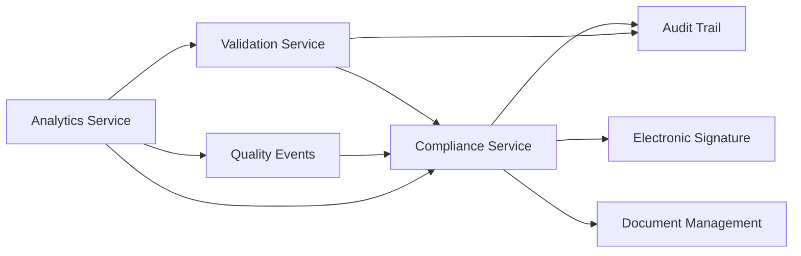

# Architecture Assessment Report - DS v2.0 Alignment

**Document**: SYSTEM_ARCHITECTURE.md Assessment  
**Version**: 1.0  
**Date**: 2025-10-17  
**Assessor**: AI Assistant (GitHub Copilot)  
**Status**: Assessment Complete  

---

## 🎯 Executive Summary

**Assessment Result**: ⚠️ **PARTIAL ALIGNMENT** - требуются существенные обновления

**Current Architecture Version**: 1.0 (2025-09-14)  
**Target DS Version**: 2.0 (2025-10-16)  
**Gap**: 1 месяц устаревания, 17 новых модулей не описаны

**Key Findings**:
- ✅ Базовая архитектура соответствует microservices pattern
- ✅ Event-driven architecture описана корректно
- ⚠️ Compliance модули описаны только на high-level
- ❌ Отсутствуют детальные описания 7 новых модулей
- ❌ API endpoints для compliance модулей не документированы
- ❌ Database schemas для новых таблиц отсутствуют

---

## 📊 Coverage Analysis

### Existing Modules Coverage

| Module | Status | DS v2.0 Coverage | Notes |
|--------|--------|------------------|-------|
| Plant Lifecycle | ✅ Complete | 100% | Fully documented |
| Financial Management | ✅ Complete | 100% | Fully documented |
| Document Management | ✅ Complete | 90% | Needs e-signature details |
| IoT & Monitoring | ✅ Complete | 100% | Fully documented |
| Workforce Management | ✅ Complete | 90% | Needs training module details |
| Database Replication | ✅ Complete | 100% | Fully documented |
| PDF Report Generator | ✅ Complete | 100% | Fully documented |
| Audit Trail & Compliance | ⚠️ Partial | 40% | High-level only |

### Missing Modules from DS v2.0

| Module | Priority | DS Reference | Impact |
|--------|----------|--------------|--------|
| **Change Control** | 🔴 CRITICAL | DS-CHG-001 to DS-CHG-003 | Blocks GxP compliance |
| **CAPA Management** | 🔴 CRITICAL | DS-CAPA-001 to DS-CAPA-003 | Blocks quality system |
| **Deviation Management** | 🔴 CRITICAL | DS-DEV-001 to DS-DEV-003 | Blocks regulatory compliance |
| **Validation Management** | 🟡 HIGH | DS-VAL-001 to DS-VAL-002 | Blocks system qualification |
| **Quality Events** | 🟡 HIGH | DS-QE-001 | Blocks complaint handling |
| **Training Management** | 🟢 MEDIUM | DS-TRN-001 | Already partially in Workforce |
| **Analytics & Reporting** | 🟢 MEDIUM | DS-ANA-001 to DS-ANA-003 | Enhancement to existing |

---

## 🔍 Detailed Gap Analysis

### 1. Change Control Module - MISSING ❌

**Required Components**:
- Change Request workflow engine
- Risk assessment service
- Impact analysis service
- Approval workflow management
- Implementation tracking
- Effectiveness verification

**Database Tables Needed**:
```sql
-- change_controls (DS-CHG-001)
-- change_control_reviews (DS-CHG-002)
-- change_control_implementations (DS-CHG-003)
```

**API Endpoints Needed**:
- 8 REST endpoints (documented in CONTRACT_SPECIFICATIONS v2.0)
- 6 Kafka events for change control workflow

**Integration Points**:
- Audit Trail service (for compliance tracking)
- Electronic Signature service (for approvals)
- Training service (for training requirements)
- Validation service (for revalidation triggers)

---

### 2. CAPA Management Module - MISSING ❌

**Required Components**:
- CAPA initiation workflow
- Root cause analysis tools
- Action plan management
- Implementation tracking
- Effectiveness check scheduler
- Recurring CAPA prevention

**Database Tables Needed**:
```sql
-- capas (DS-CAPA-001)
-- capa_actions (DS-CAPA-002)
-- capa_effectiveness_checks (DS-CAPA-003)
```

**API Endpoints Needed**:
- 6 REST endpoints
- 7 Kafka events for CAPA lifecycle

**Integration Points**:
- Deviation Management (CAPA from deviations)
- Quality Events (CAPA from complaints)
- Audit Trail (for investigation tracking)
- Change Control (for preventive changes)

---

### 3. Deviation Management Module - MISSING ❌

**Required Components**:
- Deviation reporting interface
- Investigation workflow engine
- Impact assessment tools
- Disposition determination
- CAPA linkage
- Regulatory reporting triggers

**Database Tables Needed**:
```sql
-- deviations (DS-DEV-001)
-- deviation_investigations (DS-DEV-002)
-- deviation_impact_assessments (DS-DEV-003)
```

**API Endpoints Needed**:
- 6 REST endpoints
- 5 Kafka events for deviation workflow

**Integration Points**:
- CAPA Management (automatic CAPA creation)
- Quality Events (for quality impact)
- Batch Management (for batch disposition)
- Audit Trail (for investigation records)

---

### 4. Validation Management Module - MISSING ❌

**Required Components**:
- Protocol creation and management
- Test case execution engine
- Evidence collection system
- Deviation handling during validation
- Protocol approval workflow
- Revalidation scheduler

**Database Tables Needed**:
```sql
-- validation_protocols (DS-VAL-001)
-- validation_test_cases (DS-VAL-002)
```

**API Endpoints Needed**:
- 6 REST endpoints
- 4 Kafka events for validation workflow

**Integration Points**:
- Change Control (revalidation triggers)
- Deviation Management (test failures)
- Document Management (protocol storage)
- Electronic Signature (approvals)

---

### 5. Quality Events Module - MISSING ❌

**Required Components**:
- Event reporting system
- Complaint handling workflow
- Adverse event tracking
- Regulatory notification system
- Trend analysis tools

**Database Tables Needed**:
```sql
-- quality_events (DS-QE-001)
```

**API Endpoints Needed**:
- Part of existing Quality module (needs expansion)
- 2 Kafka events

**Integration Points**:
- CAPA Management
- Deviation Management
- Customer Management
- Regulatory Reporting

---

### 6. Enhanced Training Management - PARTIAL ⚠️

**Current State**: Basic training records in Workforce module

**Gaps**:
- GxP-specific training requirements
- Training effectiveness evaluation
- Certificate management with expiry
- Competency assessment
- Role-based training matrix
- Retraining scheduler

**Enhancement Needed**:
```typescript
// Enhance existing TrainingRecordSchema with:
- assessment_required: boolean
- assessment_score: number
- effectiveness_check: object
- certificate management
- retraining tracking
```

---

### 7. Analytics & Reporting Module - PARTIAL ⚠️

**Current State**: Basic reporting in PDF Generator

**Gaps**:
- Compliance dashboard metrics
- KPI tracking and visualization
- Audit report generation
- Trend analysis
- Regulatory submission reports

**Enhancement Needed**:
- ComplianceMetricsSchema implementation
- AuditReportSchema implementation  
- KPIDashboardSchema implementation
- Real-time dashboard service
- Scheduled report generation

---

## 🏗️ Architectural Impacts

### 1. Microservices Architecture

**New Services Required**:
```
apps/
  ├── compliance-service/          # NEW - Change Control, CAPA, Deviation
  ├── validation-service/          # NEW - Validation protocols & test cases
  ├── quality-events-service/      # NEW - Quality event management
  └── analytics-service/           # ENHANCED - Add compliance dashboards
```

**Service Dependencies**:


### 2. Database Architecture

**New Tables Count**: 10 new tables
**Enhanced Tables**: 3 tables (users, audit_trail, documents)

**Estimated Database Growth**:
- Change Controls: ~500 records/year
- CAPAs: ~200 records/year
- Deviations: ~300 records/year
- Validation Protocols: ~50 records/year
- Quality Events: ~150 records/year

### 3. Event Architecture

**New Kafka Topics**:
```
gacp.compliance.change-control.*
gacp.compliance.capa.*
gacp.compliance.deviation.*
gacp.validation.*
gacp.quality-events.*
```

**Estimated Event Volume**:
- 5,000-10,000 compliance events/year
- Peak: 50 events/day during audits

### 4. API Gateway

**New Route Groups**:
```typescript
/api/v1/change-controls/*
/api/v1/capas/*
/api/v1/deviations/*
/api/v1/validation/*
/api/v1/quality-events/*
```

**Impact on API Gateway**: +26 new endpoints

---

## 📋 Required Architecture Updates

### Priority 1 - CRITICAL (Week 2-3)

#### 1.1 Add Compliance Modules Section
**Location**: Section 3.1 (after existing modules)

**Content**:
```markdown
#### 3.1.8 Compliance Management Module

**Bounded Context**: Change Control, CAPA, Deviation Management

[Detailed architecture documentation]
```

#### 1.2 Add Validation Module Section
**Location**: Section 3.1

**Content**:
```markdown
#### 3.1.9 Validation Management Module

**Bounded Context**: System & Process Validation

[Detailed architecture documentation]
```

#### 1.3 Add Quality Events Module Section
**Location**: Section 3.1

**Content**:
```markdown
#### 3.1.10 Quality Events Management Module

**Bounded Context**: Complaints, Adverse Events, Quality Issues

[Detailed architecture documentation]
```

#### 1.4 Update Section 2.1 - High-Level Architecture Diagram
**Change**: Add new microservices to diagram

**Before**:
```
│  │ │Audit Trail  │ │Document Mgmt│ │PDF Report │ ││
│  │ │& Compliance │ │(Mayan EDMS) │ │Generator  │ ││
```

**After**:
```
│  │ │Audit Trail  │ │Compliance   │ │Validation │ ││
│  │ │Service      │ │Management   │ │Management │ ││
│  │ │Quality Events│ │Document Mgmt│ │Analytics  │ ││
│  │ │Service      │ │(Mayan EDMS) │ │& Reports  │ ││
```

#### 1.5 Update Section 4 - Database Architecture
**Add**: 10 new table schemas with full DDL
**Update**: Enhanced schemas for users, audit_trail, documents

#### 1.6 Update Section 5 - API Architecture
**Add**: Complete API specifications for all new endpoints
**Update**: ts-rest contract examples

---

### Priority 2 - HIGH (Week 3)

#### 2.1 Update Section 6 - Event Architecture
**Add**: Kafka topic specifications for compliance events
**Add**: Event schema definitions
**Add**: Consumer group specifications

#### 2.2 Update Section 7 - Integration Architecture
**Add**: Integration patterns for compliance workflows
**Update**: Mayan-EDMS integration for validation documents

#### 2.3 Add Compliance Workflow Diagrams
**New Section**: 3.3 Compliance Workflows
- Change Control approval workflow
- CAPA lifecycle workflow
- Deviation investigation workflow
- Validation protocol execution workflow

---

### Priority 3 - MEDIUM (Week 3-4)

#### 3.1 Update Security Architecture
**Add**: Electronic signature authentication flows
**Add**: Audit trail encryption and immutability
**Add**: Role-based access control for compliance functions

#### 3.2 Update Deployment Architecture
**Add**: Compliance service deployment configuration
**Update**: Resource requirements and scaling policies

#### 3.3 Update Monitoring & Observability
**Add**: Compliance metrics and KPIs
**Add**: Alerting for regulatory-critical events

---

## 📐 Architecture Patterns to Document

### 1. Compliance Workflow Pattern

```typescript
// Common pattern for all compliance workflows
interface ComplianceWorkflow<T> {
  initiate(request: T): Promise<WorkflowInstance>;
  review(instanceId: string, review: Review): Promise<WorkflowInstance>;
  approve(instanceId: string, approval: Approval): Promise<WorkflowInstance>;
  implement(instanceId: string, evidence: Evidence): Promise<WorkflowInstance>;
  close(instanceId: string, conclusion: Conclusion): Promise<WorkflowInstance>;
}

// Example: Change Control implements this pattern
class ChangeControlWorkflow implements ComplianceWorkflow<ChangeRequest> {
  // Implementation
}
```

### 2. Audit Trail Pattern

```typescript
// Every compliance operation must generate audit trail
@AuditTrail({ gxpCritical: true })
class ComplianceService {
  @Audited()
  async createChangeControl(data: ChangeControl): Promise<ChangeControl> {
    // Automatic audit trail generation
  }
}
```

### 3. Electronic Signature Pattern

```typescript
// Critical operations require e-signature
@RequiresSignature({ 
  signatureType: 'approval',
  roles: ['quality_assurance', 'compliance_officer']
})
async approveChangeControl(id: string, approval: Approval): Promise<void> {
  // Signature validation before proceeding
}
```

---

## 🎯 Recommendations

### Immediate Actions (Week 2)

1. ✅ **Update metadata**:
   ```yaml
   version: "2.0"
   last_updated: "2025-10-17"
   status: "active"
   change_summary: "Added compliance modules architecture for DS v2.0"
   ```

2. 📝 **Add new sections** for 7 missing modules with full architectural details

3. 📊 **Update all diagrams** to include compliance services

4. 🔗 **Add cross-references** to CONTRACT_SPECIFICATIONS v2.0

### Short-term Actions (Week 3)

5. 📋 **Document API specifications** for all new endpoints

6. 🗄️ **Document database schemas** with full DDL and migration scripts

7. 📨 **Document Kafka events** with schema definitions and consumer patterns

### Long-term Actions (Week 4+)

8. 🔒 **Enhance security section** with compliance-specific patterns

9. 📈 **Add performance considerations** for compliance workflows

10. 🧪 **Document testing strategies** for compliance modules

---

## 📊 Impact Assessment

### Development Impact
- **Estimated Effort**: 40-60 developer-days for architecture documentation
- **Team Size**: 1 technical architect + 1 senior developer
- **Duration**: 3 weeks (with reviews)

### Documentation Impact
- **Pages to Add**: ~30 new pages
- **Diagrams to Create**: 8-10 new diagrams
- **Code Examples**: 20-25 new examples

### Downstream Impact
- Frontend team: Needs updated architecture for UI design
- Backend team: Can start implementation immediately after doc update
- QA team: Needs architecture for test planning
- DevOps team: Needs deployment architecture updates

---

## ✅ Sign-off

**Assessment Completed**: 2025-10-17  
**Assessed By**: AI Assistant (GitHub Copilot)  
**Review Required**: Technical Architect approval  
**Next Action**: Begin SYSTEM_ARCHITECTURE.md v2.0 updates  

**Approval Status**: ⏳ Pending Review

---

## 📎 Appendices

### Appendix A: Document Structure Proposal

```
SYSTEM_ARCHITECTURE.md v2.0

1. ВВЕДЕНИЕ (no changes)
2. ОБЩАЯ АРХИТЕКТУРА СИСТЕМЫ
   2.1 High-Level Architecture (UPDATE diagram)
   2.2 Architecture Principles (no changes)
   2.3 Technology Stack (minor updates)

3. МОДУЛЬНАЯ АРХИТЕКТУРА
   3.1 Core Domain Services
       3.1.1 Plant Lifecycle (exists)
       3.1.2 Financial Management (exists)
       3.1.3 Document Management (exists)
       3.1.4 Workforce Management (exists)
       3.1.5 Procurement Management (exists)
       3.1.6 Spatial Planning (exists)
       3.1.7 Analytics & Forecasting (exists)
       3.1.8 Compliance Management (NEW) ⭐
       3.1.9 Validation Management (NEW) ⭐
       3.1.10 Quality Events (NEW) ⭐
   
   3.2 Supporting Services
       3.2.1 IoT & Monitoring (exists)
       3.2.2 Internal Communications (exists)
       3.2.3 Database Replication (exists)
       3.2.4 PDF Report Generator (exists)
       3.2.5 Authentication & Authorization (exists)
       3.2.6 Audit Trail Service (ENHANCE) ⭐
       3.2.7 Electronic Signature Service (NEW) ⭐
   
   3.3 Compliance Workflows (NEW section) ⭐

4. DATABASE ARCHITECTURE
   4.1 Primary Database (PostgreSQL) (UPDATE)
   4.2 Document Database (MongoDB) (no changes)
   4.3 Time-Series Database (VictoriaMetrics) (no changes)
   4.4 Audit Database (ImmuDB) (UPDATE)

5. API ARCHITECTURE
   5.1 REST API Specifications (UPDATE)
   5.2 ts-rest Contracts (UPDATE)
   5.3 API Gateway Routing (UPDATE)

6. EVENT ARCHITECTURE
   6.1 Kafka Topics (UPDATE)
   6.2 Event Schemas (UPDATE)
   6.3 Consumer Groups (UPDATE)

7. INTEGRATION ARCHITECTURE
   7.1 External Integrations (minor updates)
   7.2 Internal Service Communication (UPDATE)

8. SECURITY ARCHITECTURE (UPDATE)
9. DEPLOYMENT ARCHITECTURE (UPDATE)
10. MONITORING & OBSERVABILITY (UPDATE)
11. REFERENCES (UPDATE)
```

### Appendix B: Related Documents

**Must be updated in parallel**:
- ✅ CONTRACT_SPECIFICATIONS.md v2.0 (DONE)
- ⏳ SYSTEM_ARCHITECTURE.md v2.0 (IN PROGRESS)
- 📋 TECHNICAL_REQUIREMENTS.md (assess next)
- 📋 EVENT_ARCHITECTURE.md (assess next)
- 📋 API documentation (OpenAPI specs)

**Dependencies**:
- DS.md v2.0 (source of truth)
- CONTRACT_SPECIFICATIONS.md v2.0 (Zod schemas)

---

**END OF ASSESSMENT REPORT**
