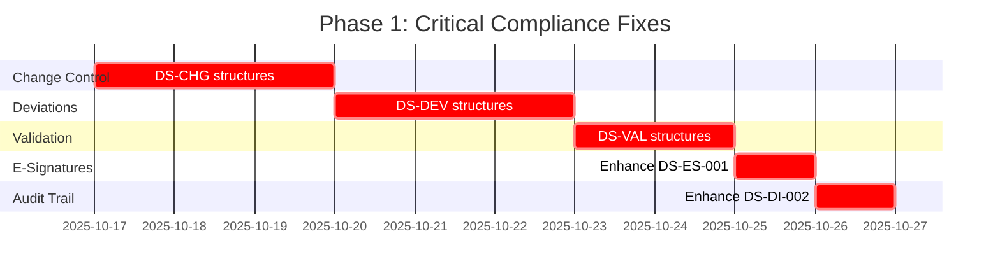

# Data Dictionary Compliance Analysis - Executive Summary

**Дата**: 2025-10-16  
**Статус**: 🔴 **КРИТИЧЕСКИ ВАЖНО**  
**Приоритет**: P0 - Блокер для Production

---

## 📊 Ключевые Находки

### Текущее Состояние

```
DS.md: v1.0 (устарело на 1 месяц)
  ├─ Последнее обновление: 2025-09-14
  ├─ Compliance документы: 2025-10-15 (актуальнее!)
  └─ Разрыв в версионности: КРИТИЧНО

Регуляторная Готовность:
  ├─ FDA 21 CFR Part 11: ❌ НЕ ГОТОВО (12 критических gaps)
  ├─ EU GMP Annex 11: ❌ НЕ ГОТОВО (8 критических gaps)
  └─ ALCOA+: ⚠️ ЧАСТИЧНО (реализовано 60%)
```

### Статистика Несоответствий

| Серьезность | Количество | Требует Действий |
|-------------|------------|------------------|
| 🔴 Критические | 40 | Немедленно (Недели 1-2) |
| 🟠 Высокие | 67 | Срочно (Недели 3-4) |
| 🟡 Средние | 88 | Плановые (Недели 5-6) |
| **ВСЕГО** | **195** | **6 недель** |

---

## 🚨 Топ-5 Критических Проблем

### 1. Отсутствие Change Control System

**Требование**: EU GMP Annex 11, Clause 12  
**Риск**: Изменения в системе не документируются и не утверждаются  
**Действие**: Создать DS-CHG-001, DS-CHG-002, DS-CHG-003

### 2. Отсутствие Deviation Management

**Требование**: EU GMP Annex 11, Clause 13  
**Риск**: Нарушения и отклонения не отслеживаются  
**Действие**: Создать DS-DEV-001, DS-DEV-002, DS-CAPA-001

### 3. Неполная Electronic Signatures

**Требование**: FDA 21 CFR Part 11 § 11.50 & § 11.70  
**Риск**: E-signatures не соответствуют FDA требованиям  
**Действие**: Дополнить DS-ES-001 полями `meaning`, `signed_entity_type`, `linked_record_hash`

### 4. Отсутствие Validation Tracking

**Требование**: FDA 21 CFR Part 11 § 11.10(a)  
**Риск**: Нет доказательств валидации системы  
**Действие**: Создать DS-VAL-001, DS-VAL-002, DS-VAL-003

### 5. Нет Data Retention Management

**Требование**: FDA 21 CFR Part 11 § 11.10(c)  
**Риск**: Данные могут быть удалены преждевременно  
**Действие**: Создать DS-DI-004, DS-DI-005

---

## 📋 Необходимые Действия

### Немедленные (Недели 1-2) - БЛОКЕР



**Deliverables**:

1. ✅ DS.md v2.0 с критическими структурами
2. ✅ Compliance Mapping Matrix
3. ✅ Migration scripts для БД
4. ✅ QA Review и утверждение

### Срочные (Недели 3-4)

- Document Control System (DS-DOC-001, 002, 003)
- Quality Events (DS-QE-001)
- Workflow Management (DS-WF-004, 005)
- Vendor Qualification enhancement

### Плановые (Недели 5-6)

- Data Dictionary реструктуризация
- ALCOA+ полная интеграция
- Compliance mapping финализация

---

## 💰 Оценка Рисков

### Если НЕ исправить

**Регуляторные Риски**:

- 🚫 Warning Letter от FDA
- 🚫 Отказ в GMP сертификации
- 🚫 Приостановка производства
- 💸 Потенциальные штрафы: $50,000 - $500,000

**Бизнес Риски**:

- ❌ Невозможность запуска производства
- ❌ Потеря доверия инвесторов
- ❌ Задержка time-to-market: 3-6 месяцев
- 💸 Стоимость переделки: $200,000 - $500,000

### Если исправить сейчас

**Преимущества**:

- ✅ Production-ready через 6 недель
- ✅ Regulatory compliance готовность
- ✅ Конкурентное преимущество (compliance-first)
- 💰 Стоимость исправления: $50,000 - $100,000

**ROI**: Соотношение затрат 1:5 (исправить сейчас vs. позже)

---

## 📈 Метрики Успеха

### Целевые Показатели

```
Compliance Coverage:
  Current: 45% ❌
  Phase 1 Target: 75% ⚠️
  Phase 2 Target: 90% ✅
  Phase 3 Target: 95%+ ✅✅

Critical Gaps:
  Current: 40 🔴
  Week 2: 10 🟠
  Week 4: 0 ✅

FDA Readiness:
  Current: NOT READY ❌
  Week 4: LIMITED USE ⚠️
  Week 6: AUDIT READY ✅
```

---

## 🎯 Рекомендации

### Для Руководства

1. **Немедленно**: Утвердить Phase 1 budget и timeline
2. **Срочно**: Назначить dedicated team для compliance work
3. **Важно**: Заморозить новые features до завершения Phase 1
4. **Стратегия**: Рассмотреть external compliance audit перед go-live

### Для Команды Разработки

1. **Приоритет #1**: Compliance над features
2. **Требование**: Ежедневные статус-апдейты
3. **Процесс**: Peer review всех compliance изменений
4. **Тестирование**: Создать compliance test suite

### Для QA

1. **Немедленно**: Review предложенных изменений DS.md
2. **Срочно**: Разработать compliance validation checklist
3. **Важно**: Координировать с regulatory consultant
4. **Процесс**: Sign-off на каждый Phase deliverable

---

## 📚 Созданные Документы

1. **DATA_DICTIONARY_COMPLIANCE_AUDIT.md** (74KB)
   - Полный audit report с детальными находками
   - Все 195 несоответствий документированы
   - SQL примеры для каждой недостающей структуры

2. **DS_UPDATE_ACTION_PLAN.md** (15KB)
   - Пошаговый plan для обновления DS.md
   - Timeline с weekly milestones
   - Acceptance criteria и risks

3. **DATA_DICTIONARY_SUMMARY.md** (этот файл)
   - Executive summary для stakeholders
   - High-level risks и recommendations

---

## 🚦 Следующие Шаги

### Сегодня (2025-10-16)

- [ ] Review этих документов с QA Lead
- [ ] Получить approval для начала Phase 1
- [ ] Создать JIRA tickets для Phase 1 tasks
- [ ] Назначить ответственных за каждый DS-* модуль

### Завтра (2025-10-17)

- [ ] Начать обновление DS.md v2.0
- [ ] Создать DS-CHG-001, DS-CHG-002, DS-CHG-003
- [ ] Разработать migration scripts

### Эта Неделя (до 2025-10-20)

- [ ] Завершить все critical structures
- [ ] Internal QA review
- [ ] Начать Database migration planning

---

## 📞 Контакты и Ресурсы

**Документация**:

- Audit Report: `/docs/reports/DATA_DICTIONARY_COMPLIANCE_AUDIT.md`
- Action Plan: `/docs/reports/DS_UPDATE_ACTION_PLAN.md`
- Current DS: `/docs/validation/DS.md` (v1.0)
- Compliance Docs: `/docs/compliance/*.md`

**Команда**:

- QA Lead: [Требуется назначить reviewer]
- Dev Lead: [Требуется назначить owner]
- Compliance: [Рекомендуется external consultant]

**Регуляторные Ссылки**:

- FDA 21 CFR Part 11: `/docs/compliance/FDA_21CFR_Part11.md`
- EU GMP Annex 11: `/docs/compliance/EU_GMP_Annex11.md`
- ALCOA+: `/docs/compliance/ALCOA+.md`

---

**Подготовлено**: AI Copilot  
**Версия**: 1.0  
**Статус**: Ready for Leadership Review  
**Действие Требуется**: Approval для начала Phase 1
