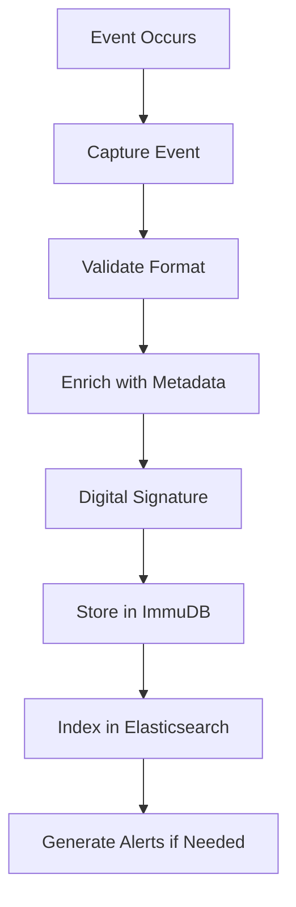

# SOP: Audit Trail

## 1. Purpose

Обеспечение неизменяемой, полной и достоверной записи всех критических действий в ERP системе в соответствии с принципами ALCOA+ и требованиями GACP для обеспечения трассируемости и соответствия нормативным требованиям.

## 2. Scope

Данная процедура охватывает:

- Все пользовательские действия в ERP системе
- Системные события и автоматические процессы
- Интеграционные взаимодействия с внешними системами
- Изменения конфигурации и администрирование
- Критические бизнес-транзакции
- Доступ к конфиденциальной информации

## 3. Responsibilities

| Роль                       | Ответственность                                      |
| -------------------------- | ---------------------------------------------------- |
| **Compliance Officer**     | Общий контроль соответствия ALCOA+ и GxP требованиям |
| **IT Administrator**       | Техническая поддержка системы журналирования         |
| **Quality Manager**        | Периодический анализ и верификация audit trail       |
| **System Administrator**   | Конфигурация и мониторинг системы логирования        |
| **Database Administrator** | Обеспечение целостности и резервирование данных      |
| **Internal Auditor**       | Проведение аудитов системы и данных                  |
| **All Users**              | Понимание и соблюдение принципов data integrity      |

## 4. ALCOA+ Principles Implementation

### 4.1 Attributable (Атрибутивность)

Каждая запись должна содержать:

```yaml
Audit_Record:
  user_id: "unique_user_identifier"
  user_name: "full_name"
  user_role: "system_role"
  session_id: "unique_session_id"
  ip_address: "source_ip"
  location: "geographic_location"
  device_info: "browser/app_info"
```

### 4.2 Legible (Читаемость)

- Записи в человекочитаемом формате
- Стандартизированные коды действий
- Понятные описания операций
- Поддержка Unicode для международных символов

### 4.3 Contemporaneous (Одновременность)

- Записи создаются в режиме реального времени
- Максимальная задержка: 5 секунд
- Синхронизация временных меток с NTP
- Фиксация времени в UTC+0

### 4.4 Original (Подлинность)

- Прямая запись из источника
- Отсутствие промежуточных обработок
- Сохранение оригинальных данных
- Цифровые подписи для критических операций

### 4.5 Accurate (Точность)

- Валидация данных перед записью
- Контроль целостности
- Проверка корректности timestamp
- Автоматическое обнаружение аномалий

### 4.6 Complete (Полнота)

- Запись всех критических событий
- Включение контекстной информации
- Сохранение метаданных
- Отсутствие пропущенных событий

### 4.7 Consistent (Согласованность)

- Единый формат записей
- Стандартизированная терминология
- Консистентность во времени
- Соответствие установленным процедурам

### 4.8 Enduring (Долговечность)

- Неизменяемое хранение (WORM)
- Долгосрочная архивация
- Защита от повреждений
- Множественные резервные копии

### 4.9 Available (Доступность)

- Быстрый поиск и извлечение
- Авторизованный доступ
- Экспорт в стандартных форматах
- Восстановление при сбоях

## 5. Audit Trail Architecture

### 5.1 Technical Implementation

```yaml
Architecture:
  Event_Capture:
    - Application_Level: "ERP module hooks"
    - Database_Level: "Triggers and change logs"
    - System_Level: "OS and network events"
    - API_Level: "All API calls and responses"

  Event_Processing:
    - Message_Queue: "Apache Kafka"
    - Stream_Processing: "Real-time validation"
    - Enrichment: "Context and metadata addition"
    - Routing: "Based on event type"

  Storage:
    - Primary: "ImmuDB (immutable database)"
    - Backup: "Encrypted cloud storage"
    - Archive: "Long-term retention system"
    - Index: "Elasticsearch for fast search"
```

### 5.2 Event Categories

| Category           | Description                          | Retention Period |
| ------------------ | ------------------------------------ | ---------------- |
| **Authentication** | Login/logout events                  | 7 years          |
| **Business Data**  | CRUD operations on business records  | Permanent        |
| **System Admin**   | Configuration changes                | Permanent        |
| **Security**       | Access violations, privilege changes | Permanent        |
| **Quality**        | QC/QA operations and approvals       | Permanent        |
| **Regulatory**     | Compliance-related actions           | Permanent        |

## 6. Procedure

### 6.1 Automatic Event Capture

1. **Application Level Logging**

   - Automatic capture через ERP hooks
   - Business logic triggers
   - User interface interactions
   - Workflow state changes

2. **Database Level Logging**

   - CDC (Change Data Capture)
   - Database triggers
   - Transaction logs
   - Schema changes

3. **System Level Logging**
   - Operating system events
   - Network access logs
   - File system changes
   - Security events

### 6.2 Event Processing Workflow



### 6.3 Data Validation and Integrity

1. **Real-time Validation**

   - Schema validation
   - Business rule checks
   - Data type verification
   - Completeness checks

2. **Integrity Verification**
   - Hash calculation and storage
   - Digital signatures
   - Cross-reference validation
   - Periodic integrity checks

### 6.4 Access and Retrieval

1. **Authorized Access Only**

   - Role-based access control
   - Audit trail for audit trail access
   - Time-limited access tokens
   - Purpose-based justification

2. **Search and Reporting**
   - Full-text search capabilities
   - Predefined report templates
   - Custom query builder
   - Export to multiple formats

## 7. Critical Events for Logging

### 7.1 User Management

- User creation/modification/deletion
- Role assignments and changes
- Password changes
- Failed login attempts
- Privilege escalations

### 7.2 Business Operations

- Batch creation and modifications
- Quality test results
- Product releases
- Inventory movements
- Production records

### 7.3 System Changes

- Configuration modifications
- Software deployments
- Database schema changes
- Integration configurations
- Backup and restore operations

### 7.4 Security Events

- Access violations
- Unusual access patterns
- System intrusions
- Data export operations
- Emergency access usage

## 8. Audit Trail Record Format

### 8.1 Standard Record Structure

```json
{
  "event_id": "uuid",
  "timestamp": "2025-09-01T12:34:56.789Z",
  "event_type": "USER_ACTION|SYSTEM_EVENT|BUSINESS_OPERATION",
  "severity": "LOW|MEDIUM|HIGH|CRITICAL",
  "user": {
    "id": "user_id",
    "name": "full_name",
    "role": "user_role",
    "session_id": "session_identifier"
  },
  "action": {
    "operation": "CREATE|READ|UPDATE|DELETE|APPROVE|REJECT",
    "module": "module_name",
    "object_type": "entity_type",
    "object_id": "entity_identifier",
    "description": "human_readable_description"
  },
  "details": {
    "old_values": "previous_state",
    "new_values": "current_state",
    "reason": "business_justification"
  },
  "technical": {
    "ip_address": "source_ip",
    "user_agent": "client_info",
    "transaction_id": "database_transaction",
    "correlation_id": "request_correlation"
  },
  "integrity": {
    "hash": "sha256_hash",
    "signature": "digital_signature",
    "checksum": "validation_checksum"
  }
}
```

## 9. Monitoring and Alerting

### 9.1 Real-time Monitoring

- **System Health**: Storage capacity, performance metrics
- **Data Integrity**: Hash verification, signature validation
- **Security Events**: Unauthorized access, suspicious patterns
- **Business Rules**: Compliance violations, unusual activities

### 9.2 Automated Alerts

| Alert Type            | Trigger                      | Recipients              |
| --------------------- | ---------------------------- | ----------------------- |
| **Critical Security** | Unauthorized access attempts | IT Security, Compliance |
| **Data Integrity**    | Hash mismatch, corruption    | IT Admin, QA Manager    |
| **System Failure**    | Logging service down         | IT Operations           |
| **Compliance**        | Regulatory deadline          | Compliance Officer      |

## 10. Reporting and Analytics

### 10.1 Standard Reports

- **Daily Activity Summary**: User activities by module
- **Security Report**: Failed logins, access violations
- **Data Integrity Report**: Validation results, integrity checks
- **Compliance Report**: Regulatory-required documentation
- **Performance Report**: System metrics and trends

### 10.2 Ad-hoc Investigations

- Forensic analysis capabilities
- Timeline reconstruction
- Pattern recognition
- Correlation analysis
- Root cause analysis

## 11. Data Retention and Archival

### 11.1 Retention Policies

| Data Type             | Active Retention | Archive Period | Total Retention |
| --------------------- | ---------------- | -------------- | --------------- |
| **Business Critical** | 3 years          | 7+ years       | Permanent       |
| **Quality Records**   | 5 years          | 10+ years      | Permanent       |
| **Security Events**   | 1 year           | 6+ years       | 7 years         |
| **System Logs**       | 6 months         | 4.5 years      | 5 years         |

### 11.2 Archival Process

1. **Automated Archival**

   - Policy-based migration
   - Compressed storage
   - Integrity verification
   - Index maintenance

2. **Retrieval from Archive**
   - Authorized request process
   - Timeline for restoration
   - Temporary access provision
   - Post-retrieval cleanup

## 12. Disaster Recovery

### 12.1 Backup Strategy

- **Primary Backup**: Daily incremental
- **Secondary Backup**: Weekly full backup
- **Geographic Distribution**: Multiple data centers
- **Cloud Backup**: Encrypted cloud storage

### 12.2 Recovery Procedures

1. **Corruption Detection**

   - Automated integrity checks
   - Hash verification
   - Signature validation
   - Manual verification

2. **Recovery Process**
   - Damage assessment
   - Recovery point identification
   - Data restoration
   - Integrity verification

## 13. Compliance and Validation

### 13.1 Regulatory Requirements

- **FDA 21 CFR Part 11**: Electronic records compliance
- **EU Annex 11**: Computerized systems
- **GACP Guidelines**: Good agricultural practices
- **MHRA Data Integrity**: UK regulatory requirements

### 13.2 Validation Activities

- **Installation Qualification (IQ)**: System setup verification
- **Operational Qualification (OQ)**: Functional testing
- **Performance Qualification (PQ)**: User acceptance testing
- **Periodic Review**: Ongoing compliance verification

## 14. Training Requirements

### 14.1 User Training

- **Data Integrity Principles**: ALCOA+ understanding
- **System Usage**: Proper logging practices
- **Incident Reporting**: When and how to report issues
- **Compliance Requirements**: Regulatory obligations

### 14.2 Technical Training

- **System Administration**: Configuration and maintenance
- **Troubleshooting**: Problem resolution
- **Backup and Recovery**: DR procedures
- **Security**: Access control and monitoring

## 15. Performance Indicators

| KPI                     | Target                           | Measurement Method     |
| ----------------------- | -------------------------------- | ---------------------- |
| **Logging Coverage**    | 100% of critical events          | Automated verification |
| **Data Integrity**      | 99.99% hash verification success | Continuous monitoring  |
| **System Availability** | 99.9% uptime                     | System monitoring      |
| **Response Time**       | < 100ms for logging              | Performance metrics    |
| **Storage Efficiency**  | < 80% capacity usage             | Storage monitoring     |

## 16. References

- **URS-AUD-001**: User Requirements for Audit Trail System
- **FS-AUD-001**: Functional Specification for Audit Trail
- **DS-AUD-001**: Design Specification for Audit Trail
- FDA 21 CFR Part 11: Electronic Records; Electronic Signatures
- EU GMP Annex 11: Computerised Systems
- MHRA GXP Data Integrity Guidance
- GACP Guidelines (WHO, EMA)
- ISPE GAMP 5: Risk-Based Approach to Compliant GxP Computerized Systems

## 17. Revision History

| Version | Date       | Description                         | Author             |
| ------- | ---------- | ----------------------------------- | ------------------ |
| 0.1     | 2025-09-01 | Initial draft                       | Compliance Officer |
| 0.2     | 2025-09-01 | Comprehensive ALCOA+ implementation | Compliance Officer |

## 18. Attachments

- Attachment A: Event Type Classification Matrix
- Attachment B: Audit Trail Search Guide
- Attachment C: Data Integrity Validation Procedures
- Attachment D: Emergency Access Audit Trail Template
- Attachment E: Regulatory Mapping Document
